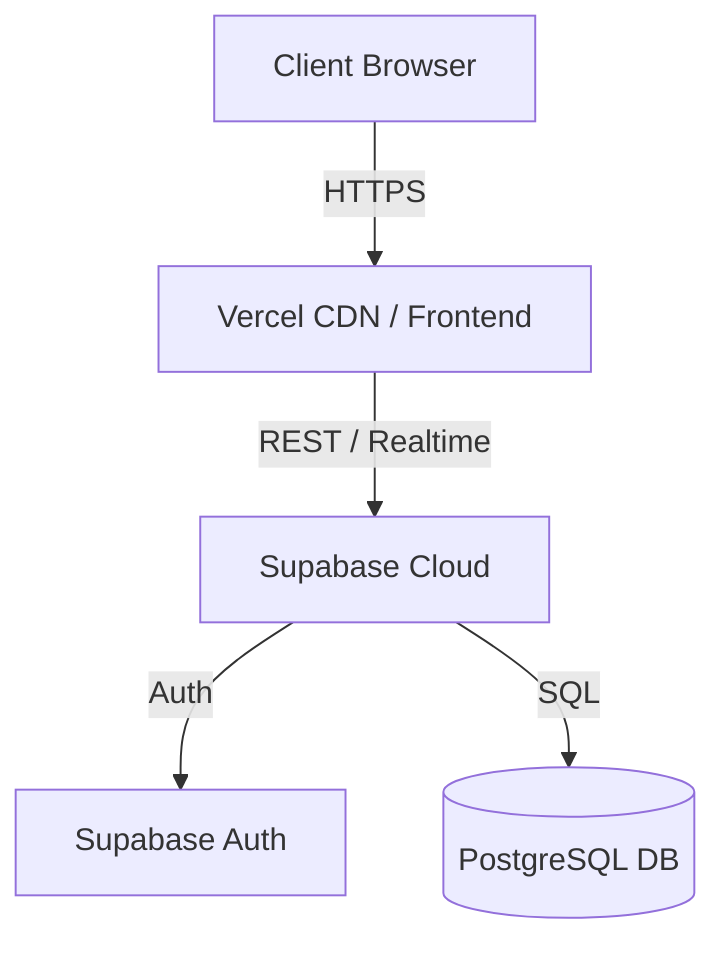

# TrackLy - Issue Tracking System

TrackLy is a modern, responsive, and highly interactive issue tracking application built with a premium dark-first SaaS aesthetic. It is designed to help teams organize, assign, and manage issues efficiently.

## Features
- **User Authentication:** Secure email/password login and registration.
- **Issue Management:** Complete CRUD operations for issues.
- **Assignment & Status Tracking:** Assign issues to team members and track their status (Open, In Progress, Closed).
- **Interactive Dashboard:** Visualizations of team progress and recent activity.
- **Comments:** Real-time discussion threads on issues.
- **Design System:** Built with Tailwind CSS v4, Framer Motion for smooth animations, and Shadcn UI patterns. Light and Dark themes supported.

## Architecture
The application uses a modern decoupled architecture:
- **Frontend:** React 18 (SPA), Vite, React Router, TanStack Query, Tailwind CSS v4.
- **Backend & Database:** Supabase (PostgreSQL, Row Level Security, Auth).
- **Hosting:** Vercel (Frontend), Supabase Cloud (Backend).



## Tech Stack
| Category | Technology |
|---|---|
| Core | React 18, TypeScript, Vite |
| Styling | Tailwind CSS v4, Lucide React, Shadcn UI patterns |
| State/Data | TanStack Query, React Hook Form, Zod |
| Animation | Framer Motion (motion/react) |
| Backend | Supabase |

## Folder Structure
```
src/
  app/          # Global providers (Auth, Theme, Router)
  components/   # Reusable UI components (Layout, Comments)
  features/     # Domain-specific logic (Auth, Issues, Dashboard)
  lib/          # Utilities and Supabase client
  pages/        # Route components (Dashboard, Issues, Login)
  styles/       # Global CSS and Tailwind tokens
supabase/       # Database migrations and seed scripts
docs/           # Documentation (BRD)
```

## Prerequisites
- Node.js (v18+)
- A Supabase account and project
- A Vercel account (for deployment)

## Local Setup

1. **Clone the repository and install dependencies**
   ```bash
   git clone <your-repo-url> trackly
   cd trackly
   npm install
   ```

2. **Supabase Setup**
   - Create a new project on [Supabase](https://supabase.com).
   - Go to the SQL Editor and run the migration script: `supabase/migrations/0001_init.sql`.
   - (Optional) Run the seed script to populate demo data: `supabase/seed.sql`.

3. **Environment Variables**
   - Copy `.env.example` to `.env`.
   - Fill in your Supabase credentials:
     ```env
     VITE_SUPABASE_URL=your-project-url
     VITE_SUPABASE_ANON_KEY=your-anon-key
     ```

4. **Run the Development Server**
   ```bash
   npm run dev
   ```
   Open `http://localhost:5173` in your browser.

## Database Schema Summary
- `profiles`: Stores user metadata, linked to Supabase Auth.
- `issues`: Stores issue details, status, priority, and relationships to reporter and assignee.
- `comments`: Discussion threads linked to issues.
*(Row Level Security is enabled on all tables to ensure users can only modify their own data.)*

## API Overview
Data operations are handled via `@supabase/supabase-js` and React Query.
- **Auth:** `signUp`, `signInWithPassword`, `signOut`.
- **Issues:**
  - `getIssues`: Selects all issues with reporter and assignee relations.
  - `createIssue`: Inserts a new row (requires authentication, reporter_id must match auth.uid()).
  - `updateIssue`: Updates a row (allowed for reporter or assignee).
  - `deleteIssue`: Deletes a row (allowed for reporter).
- **Comments:** `getComments`, `createComment`, `deleteComment`.
- **Dashboard:** RPC call to `get_dashboard_stats` function.

## Scripts
- `npm run dev`: Starts the local development server.
- `npm run build`: Compiles TypeScript and builds the Vite production bundle.
- `npm run typecheck`: Validates TypeScript without emitting.

## Deployment Instructions

1. Push your code to a GitHub repository.
2. Go to [Vercel](https://vercel.com) and import the repository.
3. In the Vercel project settings, add the Environment Variables:
   - `VITE_SUPABASE_URL`
   - `VITE_SUPABASE_ANON_KEY`
4. Deploy the project.
5. **Crucial Step:** In your Supabase Dashboard under Auth > URL Configuration, add your new Vercel domain to the "Redirect URLs" list.

## Troubleshooting
- **Deprecation Warnings:** If TypeScript warns about `baseUrl`, ignore it or use `tsc -b`. The build will still pass.
- **Login fails:** Ensure you have confirmed your email in Supabase Auth, or disable "Confirm email" in the Supabase Auth providers settings for development.


