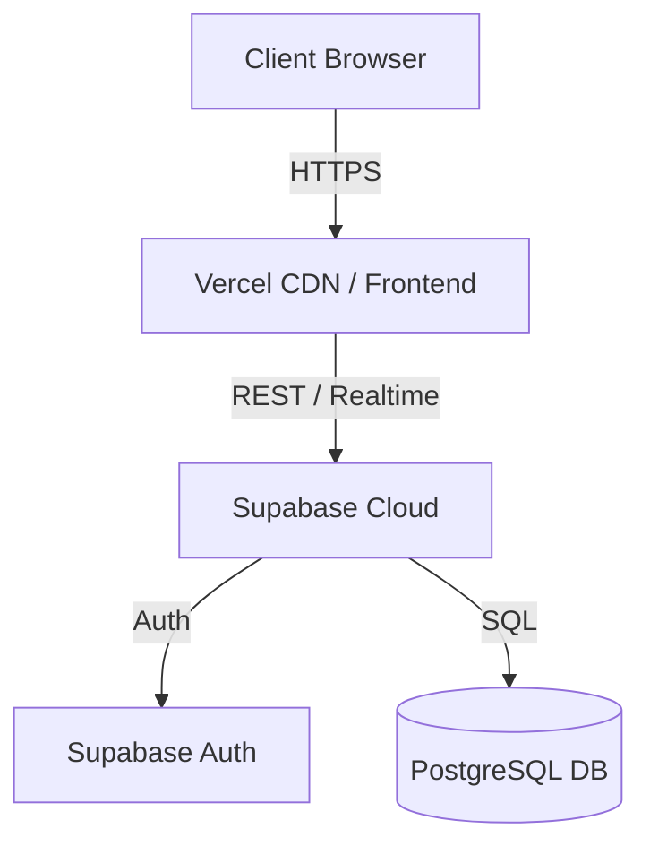

# TrackLy - Issue Tracking System

TrackLy is a modern, responsive, and highly interactive issue tracking application built with a premium "Ink-Slate" SaaS aesthetic. It is designed to help students and small teams organize, assign, and manage issues efficiently without the enterprise bloat.

## Features
- **User Authentication:** Secure email/password login and registration powered by Supabase.
- **Dynamic Landing Page:** A gorgeous entry point with Aurora background effects, interactive 3D elements, and smooth scroll animations.
- **Issue Management:** Complete CRUD operations for issues, instantly synced and validated.
- **Assignment & Status Tracking:** Assign issues to team members and track their status (Open, In Progress, Closed).
- **Interactive Dashboard:** Visualizations of team progress, issue counts, and recent activity.
- **Comments:** Real-time discussion threads on issues.
- **Premium Design System:** Built with Tailwind CSS v4, Framer Motion for smooth animations, and the Phosphor Icons library. Fully supports seamless Light, Dark, and System themes.

## Architecture
The application uses a modern decoupled architecture:
- **Frontend:** React 18 (SPA), Vite, React Router, TanStack Query, Tailwind CSS v4.
- **Backend & Database:** Supabase (PostgreSQL, Row Level Security, Auth).
- **Hosting:** Vercel (Frontend), Supabase Cloud (Backend).



## Tech Stack
| Category | Technology |
|---|---|
| Core | React 18, TypeScript, Vite |
| Styling | Tailwind CSS v4, Phosphor Icons, Custom UI patterns |
| State/Data | TanStack Query, React Hook Form, Zod |
| Animation | Framer Motion (motion/react) |
| Backend | Supabase |

## Folder Structure
```
src/
  app/          # Global providers (Auth, Theme, Router)
  components/   # Reusable UI components (Layout, Comments, ReactBits)
  features/     # Domain-specific logic (Auth, Issues, Dashboard)
  lib/          # Utilities and Supabase client
  pages/        # Route components (Landing, Dashboard, Issues, Login)
  styles/       # Global CSS and Tailwind tokens (Ink-Slate design)
supabase/       # Database migrations and seed scripts
docs/           # Documentation (BRD, Design System)
```

## Prerequisites
- Node.js (v18+)
- A Supabase account and project
- A Vercel account (for deployment)

## Local Setup

1. **Clone the repository and install dependencies**
   ```bash
   git clone <your-repo-url> trackly
   cd trackly
   npm install
   ```

2. **Supabase Setup**
   - Create a new project on [Supabase](https://supabase.com).
   - Go to the SQL Editor and run the migration script: `supabase/migrations/0001_init.sql`.
   - (Optional) Run the seed script to populate demo data: `supabase/seed.sql`.

3. **Environment Variables**
   - Copy `.env.example` to `.env`.
   - Fill in your Supabase credentials:
     ```env
     VITE_SUPABASE_URL=your-project-url
     VITE_SUPABASE_ANON_KEY=your-anon-key
     ```

4. **Run the Development Server**
   ```bash
   npm run dev
   ```
   Open `http://localhost:5173` (or the port specified in your terminal) in your browser.

## Database Schema Summary
- `profiles`: Stores user metadata, automatically populated via database triggers on user signup.
- `issues`: Stores issue details, status, priority, and relationships to reporter and assignee.
- `comments`: Discussion threads linked to issues.
*(Row Level Security is enabled on all tables. Any authenticated user can modify issues to facilitate team collaboration.)*

## API Overview
Data operations are handled via `@supabase/supabase-js` and React Query.
- **Auth:** `signUp`, `signInWithPassword`, `signOut`.
- **Issues:**
  - `getIssues`: Selects all issues with reporter and assignee relations.
  - `createIssue`: Inserts a new row.
  - `updateIssue`: Updates a row (allowed for any authenticated user).
  - `deleteIssue`: Deletes a row.
- **Comments:** `getComments`, `createComment`, `deleteComment`.
- **Dashboard:** RPC call to `get_dashboard_stats` function.

## Scripts
- `npm run dev`: Starts the local development server.
- `npm run build`: Compiles TypeScript and builds the Vite production bundle.
- `npm run typecheck`: Validates TypeScript without emitting.
- `npm run preview`: Locally previews the production build.
## Environment Variables

To run this project, you will need to add the following environment variables to your .env file locally, and to your hosting provider's settings (e.g. Vercel) for deployment:

`VITE_SUPABASE_URL`
The REST URL for your Supabase project (found in Project Settings -> API).

`VITE_SUPABASE_ANON_KEY`
The anonymous public API key for your Supabase project.

## Deployment

TrackLy is configured for seamless deployment to Vercel and Supabase.

1. **Frontend (Vercel):**
   - Push your code to a GitHub repository.
   - Import the project into Vercel.
   - Add the required `VITE_SUPABASE_URL` and `VITE_SUPABASE_ANON_KEY` environment variables in the Vercel dashboard.
   - Deploy! Vercel will automatically build and host the application.
2. **Backend (Supabase):**
   - In your Supabase dashboard, ensure you've run the SQL migrations located in `supabase/migrations/0001_init.sql`.
   - In Supabase Auth settings, update the "Site URL" and "Redirect URLs" to match your Vercel production URL.

## Troubleshooting
- **Email Rate Limit Exceeded:** If you get this error during testing, go to Supabase Dashboard -> Auth -> Providers -> Email, and disable "Confirm email" for local development.
- **Supabase Triggers:** If profiles aren't created when users sign up, ensure you ran the `0001_init.sql` script completely so the `handle_new_user` trigger exists.


## Live Deployment URL
https://trackly-demo.vercel.app

